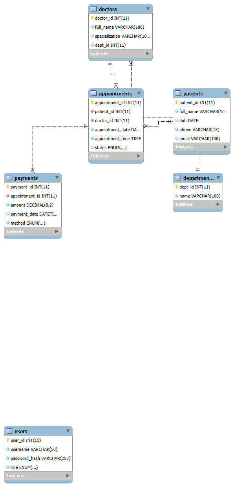

#### ClinicBookingSystem

# Clinic Booking System Database

## Description
This project is a MySQL-based database system for managing a small clinic's operations. It supports doctors, patients, appointments, and payments.

## How to Setup

1. Open MySQL or phpMyAdmin.
2. Run the SQL script `clinic_booking.sql` to create the database and all tables.
3. (Optional) Insert sample data or develop front-end/backend interfaces.

## ERD Diagram

